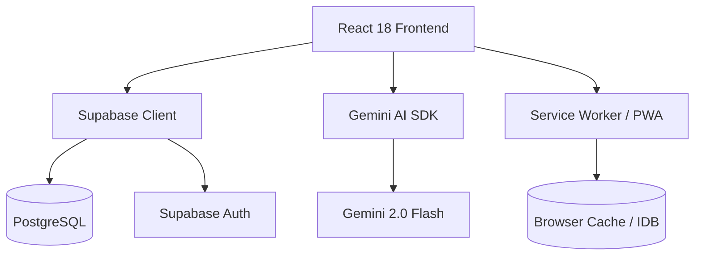

# 📖 Omni Bible

<div align="center">


**The AI-Powered Bible Study App for South Africa**

*Read. Study. Prepare. Preach.*

[Live Demo](https://bible-app-chi-mauve.vercel.app) · [Features](#-features) · [Comparison](#-competitor-comparison)

</div>

---

## 🚀 What Makes Omni Bible Different?

Omni Bible is not just another Bible reading app. It's a **complete Bible study and sermon preparation platform** with AI capabilities that no other app offers.

| What We Do | What Others Don't |
|------------|-------------------|
| 🤖 AI Sermon Builder | Build full sermons with AI assistance |
| 📚 3 Afrikaans Translations | AFR53, AFR83, AFR NLV |
| 🇿🇦 ZAR Pricing | Affordable for South Africans |
| 📖 AI Word Study | Greek/Hebrew analysis on any word |
| 💬 AI Bible Q&A | Ask questions, get scripture-backed answers |

---

## ✨ Features

### 📖 Bible Reading
| Feature | Description |
|---------|-------------|
| **6 Translations** | AFR53, AFR83, AFR NLV, KJV, NLT, AMP |
| **Split View** | Compare two translations side-by-side |
| **Red Letter** | Words of Jesus highlighted in red |
| **Offline Reading** | Download translations for offline use |
| **Verse Highlighting** | 20+ colors with custom categories |
| **Personal Notes** | Add notes to any verse |
| **Cloud Sync** | Sync highlights and notes across devices |

### 🔍 Search & Discovery
| Feature | Description |
|---------|-------------|
| **Exact Search** | Find verses containing specific words |
| **Semantic Search** | AI-powered concept-based search |
| **AI Q&A** | Ask any Bible question in natural language |
| **Search History** | Quick access to recent searches |
| **Bulk Highlight** | Highlight multiple search results at once |
| **Cross-Reference** | Navigate between related verses |

### 📝 Study Tools
| Feature | Description |
|---------|-------------|
| **Word Study** | Greek/Hebrew analysis with AI |
| **Inductive Study** | Observation → Interpretation → Application |
| **Chapter Summary** | AI-generated chapter overviews |
| **Study Notes** | Organize your personal studies |
| **Share Verses** | Create beautiful shareable images |

### ⛪ Sermon Preparation Suite
| Feature | Description |
|---------|-------------|
| **AI Skeleton** | Auto-generate sermon structure from scripture |
| **AI Content** | Generate full spoken notes for each point |
| **Sermon Audit** | AI review with improvement suggestions |
| **PDF Export** | Print-ready formatted sermons |
| **Duration Control** | Target specific time budgets |
| **Tone Selection** | High Energy, Compassionate, Teaching, etc. |
| **Research Tools** | Word Study, History, Commentary, Illustrations |

### 📰 Daily Content
| Feature | Description |
|---------|-------------|
| **AI Devotional** | Fresh daily inspiration based on your interests |
| **Recommended Reading** | Personalized articles from your search history |
| **Seasonal Awareness** | Content relevant to holidays and seasons |
| **Keyword Tracking** | Highlight topics you care about |

### ⚙️ Platform Features
| Feature | Description |
|---------|-------------|
| **PWA** | Install on any device like a native app |
| **Dark/Light Theme** | Automatic or manual theme switching |
| **Bilingual UI** | Full English and Afrikaans interface |
| **Profile System** | Profile picture, display name, cloud backup |
| **Admin Dashboard** | Analytics, user management, error logging |

---

## 🏆 Competitor Comparison

### Feature-by-Feature Analysis

| Feature | **Omni Bible** | YouVersion | Logos | Olive Tree | Blue Letter |
|---------|---------------|------------|-------|------------|-------------|
| **Free Tier** | ✅ Yes | ✅ Yes | ⚠️ Limited | ⚠️ Limited | ✅ Yes |
| **Afrikaans Bibles** | ✅ 3 versions | ✅ 2 versions | ⚠️ Paid | ⚠️ Paid | ❌ No |
| **AI Sermon Builder** | ✅ **Unique** | ❌ | ❌ | ❌ | ❌ |
| **AI Bible Q&A** | ✅ | ❌ | ❌ | ❌ | ❌ |
| **AI Word Study** | ✅ | ❌ | ⚠️ Manual | ⚠️ Manual | ⚠️ Manual |
| **Semantic Search** | ✅ AI-powered | ❌ | ⚠️ Paid | ❌ | ❌ |
| **AI Devotionals** | ✅ Personalized | ✅ Pre-written | ❌ | ❌ | ❌ |
| **Offline Bible** | ✅ | ✅ | ✅ | ✅ | ✅ |
| **Split View** | ✅ | ✅ | ✅ | ✅ | ✅ |
| **Highlighting** | ✅ 20+ colors | ✅ 5 colors | ✅ | ✅ | ⚠️ Limited |
| **Notes** | ✅ | ✅ | ✅ | ✅ | ✅ |
| **PDF Export** | ✅ Formatted | ❌ | ✅ | ✅ | ❌ |
| **Reading Plans** | ❌ Coming | ✅ | ✅ | ✅ | ✅ |
| **Social Features** | ❌ Coming | ✅ | ⚠️ | ❌ | ❌ |
| **Price** | 🆓 Free / R99/mo | 🆓 Free / $$ | 💰 $149+ | 💰 $30+ | 🆓 Free / $$ |

### Our Unique Advantages

1. **🤖 AI Sermon Builder** - No competitor has this. Generate full sermon outlines and content with AI assistance.

2. **🇿🇦 South African Focus** - 3 Afrikaans translations, ZAR pricing, local relevance.

3. **💬 Natural Language Bible Q&A** - Ask questions in plain language, get scripture-backed answers.

4. **📖 AI Word Study** - Instant Greek/Hebrew analysis on any selected word.

5. **🔍 Semantic Search** - Search by concept, not just keywords.

6. **📰 Personalized Devotionals** - AI generates fresh content based on YOUR interests.

---

## 📊 Ratings

| Category | Score | Notes |
|----------|-------|-------|
| Bible Reading | 8.5/10 | Full-featured with offline support |
| Search | 9/10 | AI semantic search is unique |
| Study Tools | 9/10 | AI Word Study, Inductive Study |
| Sermon Prep | 9.5/10 | Best-in-class, no competition |
| AI Features | 9.5/10 | Innovative and functional |
| Mobile Experience | 8/10 | PWA works well, native planned |
| Design/UX | 8/10 | Modern, clean, theme-aware |
| Value for Money | 9.5/10 | Exceptional for the price |

### **Overall: 8.9/10** ⭐⭐⭐⭐½

### **For South African Market: 9.5/10** ⭐⭐⭐⭐⭐

---

---

## 🏗️ Architecture Overview

Omni Bible is built as a **Modern Serverless Web Application** leveraging the following architecture:



- **Frontend**: A highly responsive Single Page Application (SPA) built with React and Vite.
- **Backend-as-a-Service**: Supabase handles data persistence, user authentication, and real-time synchronization.
- **AI Intelligence**: Google's Gemini 2.0 Flash powers the semantic search, word studies, and sermon preparation tools.
- **Offline First**: Service workers and IndexedDB ensure the Bible remains readable even without an internet connection.

---

## 🛠️ Tech Stack

### Core
- **React 18**: Dynamic UI components and state management.
- **Vite**: Ultra-fast build tool and development server.
- **Supabase**: Open-source Firebase alternative (Postgres + Auth).
- **Gemini 2.0 Flash**: Next-generation AI model for biblical analysis.

### Utilities
- **Vite PWA Plugin**: Handles service worker generation and manifest management.
- **React Router 6**: Client-side routing.
- **EmailJS**: Handles contact form submissions without a backend.
- **Fast-XML-Parser**: Parses USFM/XML Bible data for local processing.
- **idb**: Lightweight wrapper for IndexedDB to manage offline Bibles.

---

## 🚀 Local Setup

Follow these steps to run Omni Bible on your local machine:

### 1. Prerequisites
- [Node.js](https://nodejs.org/) (v18 or higher)
- [npm](https://www.npmjs.com/)

### 2. Clone and Install
```bash
git clone https://github.com/Andre6553/bible-app.git
cd bible-app
npm install
```

### 3. Environment Variables
Create a `.env` file in the root directory and add your Gemini API Key:
```env
VITE_GEMINI_API_KEY=your_gemini_api_key_here
```
> [!NOTE]
> Supabase credentials are currently configured in `src/config/supabaseClient.js`. In a production environment, these should also be moved to environment variables.

### 4. Run Development Server
```bash
npm run dev
```
The app will be available at `http://localhost:5173`.

---

## ☁️ Deployment

Omni Bible is optimized for deployment on **Vercel**.

### Automatic Deployment (Recommended)
1. Push your code to a GitHub repository.
2. Connect the repository to [Vercel](https://vercel.com/).
3. Add the `VITE_GEMINI_API_KEY` to the **Environment Variables** section in the Vercel dashboard.
4. Vercel will automatically detect Vite and deploy the application.

### Manual Build
```bash
npm run build
```
This will generate a `dist` folder ready to be served by any static hosting provider.

---

## 📱 Screenshots

*Coming soon*

---

## 🗺️ Roadmap

- [ ] Reading Plans
- [ ] Social/Community Features
- [ ] Audio Bible
- [ ] Native Mobile Apps (iOS/Android)
- [ ] More Translations
- [ ] Church Group Features

---

## 📄 License

Proprietary. All rights reserved.

---

<div align="center">

**Built with ❤️ for South African Christians**

*"Your word is a lamp for my feet, a light on my path." - Psalm 119:105*

</div>
